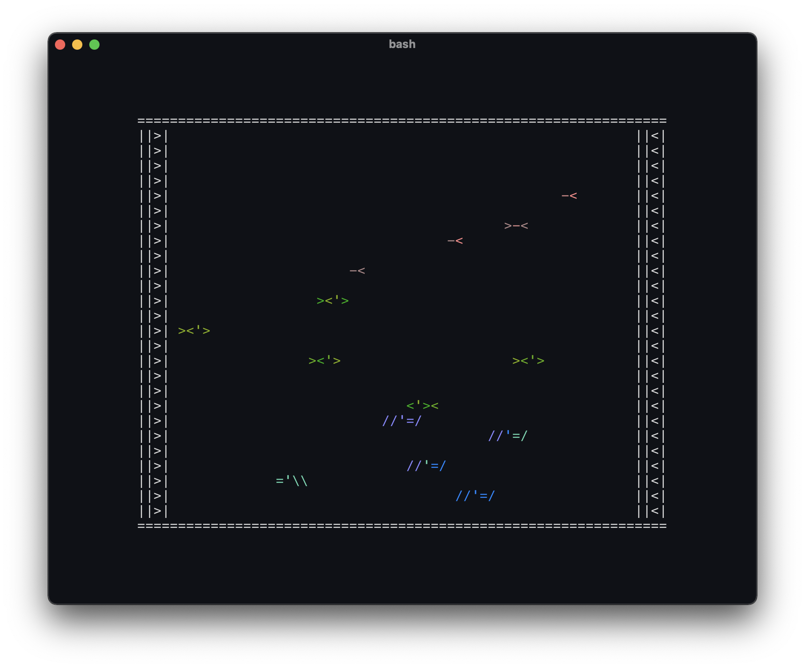
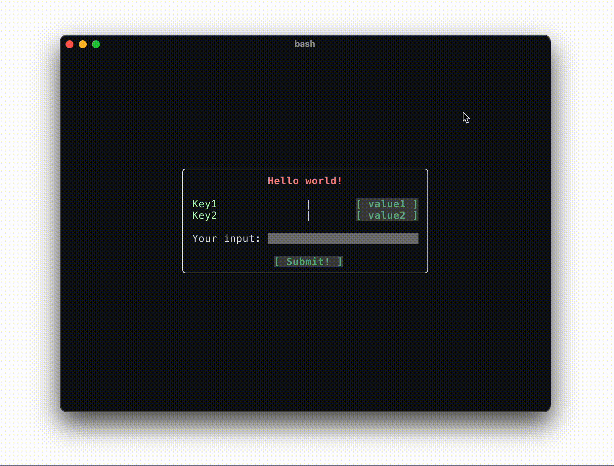

<!-- TODO: these colors could be randomly generated -->


> A simple yet powerful TUI framework for your Python (3.7+) applications
```
pip3 install pytermgui
```

[](https://pypi.org/project/pytermgui)
[](https://github.com/bczsalba/pytermgui/blob/master/utils/create_badge.py)


Batteries included or bare-metal. It's your choice.
---------------------------------------------------

pytermgui has both higher and lower level interfaces. If you're only here for the terminal APIs, `ansi_interface` will be your friend.


Adapting to your needs
----------------------

Here are just a couple of ways to define the same widget structure:

**Using the basic class structure**

```python3
# -- demo.py --
import pytermgui as ptg

demo = ptg.Window(
   ptg.Label("[210 bold]Hello world!"),
   ptg.Label(),
   ptg.InputField(prompt="Who are you?")
   ptg.Label(),
   ptg.Button("Submit!")
)
```

**Using data-pattern conversion**

```python3
# -- demo.py --
import pytermgui as ptg

demo = (
    ptg.Window()
    + "[210 bold]Hello world!"
    + ""
    + ptg.InputField(prompt="Who are you?")
    + ""
    + ["Submit!"]
)
```


**Using YAML**

```yaml
# -- demo.yaml --
widgets:
    demo:
        type: Window
        widgets:
          - Label:
                value: "[210 bold]Hello world!"
          - Label: {}

          - InputField:
                prompt: Who are you?
          - Label: {}

          - Button:
                label: Submit!
```

None of these is better than any other, it is all up to individual taste. We don't force you to do
what *we* want, rather encourage you to morph the library around your needs.

By the way, this is what the created `Window` looks like. Nifty, huh?

<p style="text-align: center">
    
</p>


Fully documented
----------------

The [documentation](https://bczsalba.github.io/pytermgui/pytermgui.html) details every public name in the library, making its usage as easy as possible. For more complete projects, check out [examples](/examples), or some of the projects using PTG.


Projects using pytermgui
------------------------

We take pride in seeing others use the library. If you have a project you'd like us to add here, create a PR!

| Project name  | Project description | Demo image |
----------------------------------------------------
<!-- Add your project below. Try to keep an alphabetical order. -->
| [`sipedon`](https://github.com/bczsalba/sipedon) | An interactive aquarium for your terminal. |  |


Some showcase images
--------------------

### A hello world program


-------------------------

### The markup playground app

> Note: Use `ptg --markapp` to try


-------------------------

### A simple window manager demo in 14 lines of code, lifted from the [docs](https://bczsalba.github.io/pytermgui/pytermgui/window_manager.html)



